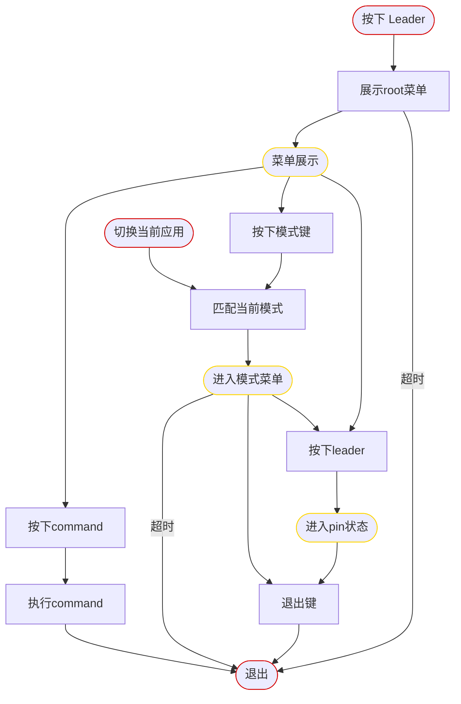

# leader key的流程图

# 实体设计

* 菜单 - Menu
  * 属性
    * id
    * name
    * father
    * items
    * status
      * PINED
      * SHOWN
      * HIDDEN
    * timeout 展示的超时时间（秒）
    * view webview对象
    * mode show后状态：pin or float
  * 方法
    * show
    * hide
    * pin
    * back

* 菜单项 - MenuItem
  * key
  * description
  * type
    * MENU
      * menu
    * COMMAND
      * command
    * FUNCTION
      * before
      * after
  * env 根据wifi判断环境

* 命令 - Command
  * type 也是路径
    * hotkey
    * window
    * app
    * task
  * params 参数
  * desciption

* 命令管理器 - CommandRegister
  * regist(command)
  * excute(command)
